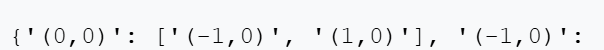

# Robotics-Maze
Final Year Robotics Maze Assessment 
# Autonomous Maze Solving Robot using VEX VR and Python

## Project Overview

This project implements an autonomous maze-solving robot using Python within the VEX VR simulation environment. The primary objective of the system is to enable a robot to navigate an unknown maze, construct a complete map of its structure, determine the most efficient route to the exit, and finally return to its starting position.

The maze environment itself is provided by the VEX VR simulator, while all navigation behaviour, decision-making logic, mapping functionality, and pathfinding algorithms were designed and implemented in Python.

The project demonstrates several key concepts from robotics and computer science, including sensor-based navigation, coordinate tracking, graph data structures, pathfinding algorithms, and autonomous decision-making.

---

## Tasks Attempted

The project successfully implements all required operational modes:

### Escape the Maze
The robot is able to explore the maze autonomously using sensor input to detect walls and navigate safely. It systematically moves through the environment until the goal location is found.

### Find the Quickest Route
After mapping the maze, the robot calculates the shortest possible path from the starting position to the exit using the Breadth-First Search (BFS) algorithm.

### Map the Maze
The robot constructs a complete internal map of the maze by recording coordinates and storing connections between positions in a graph data structure. This allows the full layout of the maze to be visualised and analysed.

### Return to Home Position
After reaching the goal, the robot calculates and follows the shortest path back to the starting location, demonstrating full two-way navigation capability.

---

## Different Theories and Approaches

### Initial Approach: Right-Wall Following Strategy

During the early stages of development, a right-wall following navigation strategy was implemented. In this approach, the robot continuously maintained contact with the wall on its right-hand side while moving through the maze.

The logic was straightforward: if a wall was detected directly ahead, the robot would turn left. If the path was clear, the robot would move forward and then turn right to continue following the wall.

This strategy proved effective for basic navigation and allowed the robot to eventually reach the exit of the maze. It ensured that the robot would not become trapped in open spaces and could successfully move through corridors.

However, this approach revealed a significant limitation. While it allowed the robot to find a path to the exit, it did not enable full exploration of the maze. The robot only followed a single continuous wall and therefore failed to visit many alternative routes and branches within the environment. As a result, it was unable to build a complete representation of the maze.

Because the robot lacked a full map of the environment, it also could not guarantee that the route taken to the exit was the most efficient path.

---

### Transition to a Graph-Based Exploration Approach

To overcome these limitations, the navigation strategy was redesigned to prioritise full maze exploration rather than simple wall following. The final solution adopted a left-wall following method combined with coordinate tracking.

This allowed the robot to systematically explore all reachable paths in the maze while continuously recording its position. Each movement was tracked using an internal coordinate system, ensuring that every visited location could be stored accurately.

As the robot explored, it constructed a graph data structure where each coordinate represented a node and each possible movement between positions represented a connection, or edge. This approach enabled the robot to build a complete internal map of the maze rather than simply navigating along a single wall.

---

### Adoption of Breadth-First Search for Optimal Pathfinding

Once a complete map of the maze had been constructed, a more advanced pathfinding method was required to determine the quickest route to the exit.

Breadth-First Search (BFS) was selected because it is specifically designed to find the shortest path in an unweighted graph. BFS works by exploring nodes level by level, starting from the initial position and expanding outward evenly in all directions.

Because each movement within the maze has equal cost, BFS guarantees that the first time the goal node is reached, the path found is the shortest possible route.

By combining full maze mapping with BFS pathfinding, the final solution achieves both accurate exploration and optimal navigation.

---

## Maze Exploration Strategy

The robot explores the maze using a left-wall following method. This strategy ensures systematic exploration while preventing the robot from becoming trapped.

The robot operates according to the following logic:

If a wall is detected ahead, the robot turns right. If the path is clear, the robot moves forward. After moving forward, it turns left to maintain contact with the wall.

This process continues until all possible paths from the starting location have been explored. The robot keeps track of how many routes exist from the starting position and stops exploring only after it has returned to the start enough times to confirm full coverage.

---

## Coordinate Tracking and Position Management

The robot tracks its location using a two-dimensional coordinate system. The starting position is defined as (0,0), and each forward movement updates the robot’s x and y coordinates based on its heading direction.

Coordinates are stored in string format, such as "(x,y)", allowing them to be easily recorded within the graph data structure. This system enables the robot to maintain an accurate internal representation of its position at all times.

---

## Maze Mapping Using Graph Data Structures

The maze is stored internally using a graph data structure. In this representation, each position within the maze is treated as a node, and each possible movement between positions is stored as a connection between nodes.

This graph is implemented using a dictionary, where each key represents a node and each value is a list of connected neighbouring nodes.

This approach provides an efficient method for storing the maze layout and allows pathfinding algorithms to operate effectively on the stored data.

---

## Shortest Path Calculation Using Breadth-First Search

The Breadth-First Search algorithm is used to determine the shortest path between two positions in the maze. BFS operates by exploring the graph layer by layer, beginning at the starting node.

A queue is used to track which nodes should be explored next, while a visited list ensures that each node is processed only once. As BFS progresses, it records the predecessor of each node, allowing the shortest path to be reconstructed once the goal is reached.

Because the maze graph is unweighted, BFS guarantees that the path found is the shortest possible route.

---

## Program Output and Visualisation

The program produces several outputs that demonstrate correct operation and mapping functionality.

The graph structure is printed to the robot’s Brain display, showing all recorded coordinates and their connections.

A visual representation of the maze is also generated using characters. Walls are displayed using block symbols, the starting position is marked with the letter O, and the goal location is marked with the letter X.

Additionally, the robot visually displays its movement paths using coloured pen trails. Black indicates exploration, Red shows the shortest route to the goal and also represents the return journey to the starting point.

---
## Screenshots of Program Output

The following screenshots provide visual evidence of the robot’s operation, maze mapping process, and pathfinding capabilities.

### Graph Structure Output

This screenshot shows the printed graph representation of the maze. Each coordinate represents a node, and the listed connections represent possible movements between positions. This confirms that the robot successfully recorded the full maze structure.

---

### Visual Maze Map

This screenshot displays the visual representation of the maze generated after exploration. Walls are shown using block characters, the starting position is marked with "O", and the goal location is marked with "X". This confirms that the robot successfully mapped the entire maze.

---

### Shortest Path and Return Journey

This screenshot shows the robot’s movement paths. The black line represents exploration, the red line shows the shortest route to the goal calculated using Breadth-First Search, and the red line shows the robot’s return journey to the starting position.

## Error Handling and Edge Cases

Several safeguards are implemented to ensure reliable operation. Maze boundaries are treated as walls to prevent the robot from exiting the environment. The program verifies that the robot is positioned correctly before following a path.

Visited nodes are tracked during BFS to prevent infinite loops, and the exploration process ensures that all reachable paths are discovered before the robot stops mapping.

These measures ensure stable performance under all conditions.

---

## Technologies Used

Python programming language  
VEXcode VR simulation environment  
Graph data structures  
Breadth-First Search algorithm  

---

## How to Run the Program

Open the VEXcode VR environment in a web browser. Select a maze playground and paste the Python code into the editor. Run the program and observe the robot exploring, mapping, solving the maze, and returning home.

---
“I confirm that no AI tools were used in the preparation or completion of this assessment. This submission aligns with AITS 1 of the Artificial Intelligence Transparency Scale (AITS).”
## References

VEX Robotics. (2024). VEXcode VR Documentation. https://education.vex.com/stemlabs/cs/cs-level-1-vexcode-vr-python
                                                https://education.vex.com/stemlabs/vr/activities

GeeksforGeeks. (2023). *Breadth First Search (BFS) for a Graph*.  
https://www.geeksforgeeks.org/breadth-first-search-or-bfs-for-a-graph/

Cormen, T. H., Leiserson, C. E., Rivest, R. L., & Stein, C. (2009). *Introduction to Algorithms*. MIT Press.

Russell, S., & Norvig, P. (2021). *Artificial Intelligence: A Modern Approach*. Pearson.

LaValle, S. M. (2006). *Planning Algorithms*. Cambridge University Press.

Thrun, S., Burgard, W., & Fox, D. (2005). *Probabilistic Robotics*. MIT Press.

Choset, H. (2001). Coverage of Known Spaces: The Boustrophedon Cellular Decomposition. *Autonomous Robots*, 9(3), 247–253.

Wikipedia. (2024). *Maze Solving Algorithm – Wall Follower Method*.  
https://en.wikipedia.org/wiki/Maze_solving_algorithm

Sedgewick, R., & Wayne, K. (2011). *Algorithms (4th Edition)*. Addison-Wesley.

---

## Author

Student Name: Derrikson Apenteng 
Module: Robotics
Submission Date: 19/02/2026
